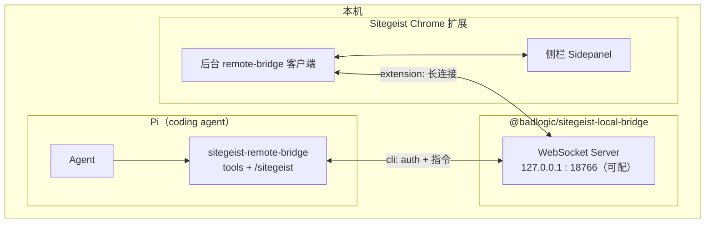
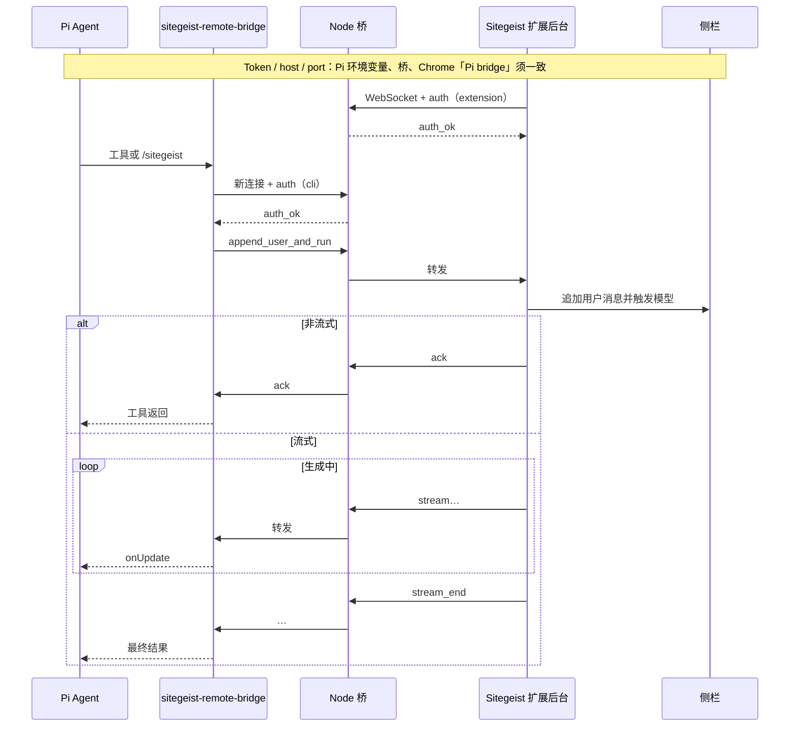

# sitegeist-remote-bridge（Pi 扩展）

Pi 扩展源码位于 `**pi-extensions/sitegeist-remote-bridge/**`（本 git 仓库内）。请将 `**pi**` 的工作目录指到 **本仓库根目录**，或在 `**settings.json` → `extensions`** 中加入 `**pi-extensions/sitegeist-remote-bridge**`，以便加载 `**index.ts**`——详见 `**pi-mono/packages/coding-agent/docs/extensions.md**`。

## 作用摘要

通过本机 WebSocket 桥（`**badlogic/sitegeist-local-bridge/**`，独立于 Sitegeist 扩展仓库，`@badlogic/sitegeist-local-bridge`），让 Pi coding agent **向 Sitegeist Chrome 扩展侧栏追加用户消息并跑一轮模型**。用户消息在侧栏以 `**/sitegeist`** 前缀显示。`**sitegeist_append_user**` 默认开启流式，可用 `**stream: false**` 仅收 ack。

## 架构与交互流程

Pi、**本目录下的 Pi 扩展 `sitegeist-remote-bridge`** 与 **Sitegeist（Chrome 扩展）** 不直连：二者都只连 **同一台本机 Node 桥**（在 `**badlogic/sitegeist-local-bridge/`** `**npm install` · `npm run bridge**`），由桥在 **CLI 连接** 与 **唯一一条 extension 长连接** 之间转发 JSON。


| 组件                          | 角色                                          | 连接                                                   |
| --------------------------- | ------------------------------------------- | ---------------------------------------------------- |
| **Pi**                      | 终端里的 coding agent                           | 经本扩展的 `bridge-client`，以 WebSocket `**role: cli`** 连桥 |
| **sitegeist-remote-bridge** | Pi 进程内加载的扩展（`index.ts` + 工具 / `/sitegeist`） | 仅使用 `SITEGEIST_BRIDGE_*` 发请求，不经过浏览器                  |
| **Node 桥**                  | `@badlogic/sitegeist-local-bridge`          | 监听 `127.0.0.1` 与端口（默认 18766），校验 token                |
| **Sitegeist**               | Chrome MV3 扩展                               | 后台 `**role: extension`** 长连到桥；侧栏负责真实会话与 UI           |


### 静态关系




### 时序：`append_user_and_run` / `/sitegeist`（示意）

CLI 先 **auth**，再发 `**append_user_and_run`**；桥转给 extension；扩展在侧栏追加 `**/sitegeist` 前缀**用户消息并跑模型。流式（P4）时，扩展经桥回传 `**stream` / `stream_end`** 等帧，Pi 侧工具通过 `**onUpdate**` 收增量。




**一句话**：Pi 通过本扩展「打桥」；桥把请求交给浏览器里的 Sitegeist；侧栏里看到的对话才是真实执行点。

## 环境准备

1. **Sitegeist 扩展**：侧栏 **设置 → Pi bridge**，token/port 与桥、Pi **三方一致**；token 留空即用默认 `**test_token`**。
2. **启动 Node 桥**：进入 `**badlogic` 根目录下的** `**sitegeist-local-bridge/`**（与 `**sitegeist/**` **同级**，不在 Sitegeist 仓库内）：
  ```bash
   npm install
   npm run bridge
  ```
   自定义密钥：`SITEGEIST_BRIDGE_TOKEN=你的密钥 npm run bridge`。**Sitegeist 根目录没有** `npm run bridge`。
3. **运行 Pi 的 shell**
  - `**SITEGEIST_BRIDGE_TOKEN`**：可选；未设置时 Pi 扩展与常规桥脚本均默认 `**test_token**`。自定义密钥时请与 Chrome 存储、桥进程一致。  
  - `**SITEGEIST_BRIDGE_PORT**`：可选，默认 `**18766**`。  
  - `**SITEGEIST_BRIDGE_HOST**`：可选，默认 `**127.0.0.1**`。  
  - `**SITEGEIST_BRIDGE_STREAM_TIMEOUT_MS**`：可选，默认 `**900000**`。`**sitegeist_append_user**` 使用流式时，等待服务端 `**stream_end**` 的最大等待时间（毫秒）。
4. 
  ```bash
   cd pi-extensions && npm install
  ```

## 工具


| 工具                          | 说明                                                                                                   |
| --------------------------- | ---------------------------------------------------------------------------------------------------- |
| `**/sitegeist**`            | 斜杠命令，语义与 `**sitegeist_append_user**` 一致（默认流式，`--no-stream` 关闭）。                                      |
| `**sitegeist_append_user**` | `**sessionId**` + `**text**`（`sessionId` 可省略，表示当前侧栏会话）→ `**append_user_and_run**`。可选 `**stream: true |
| `**sitegeist_bridge_ping**` | 经 WebSocket 发 `**ping**`，检查桥是否监听。                                                                    |


## 规范文档与冒烟测试

- `**sitegeist/.pi/extensions/sitegeist-remote-bridge/task_P3.md**`
- `**sitegeist/.pi/extensions/sitegeist-remote-bridge/task_P4_streaming.md**`

**须先**在 `**sitegeist-local-bridge/`** 终端 `**npm install` · `npm run bridge**`：

```bash
cd sitegeist && npm run test:bridge-p3
cd sitegeist && npm run test:bridge-p4-stream
```

