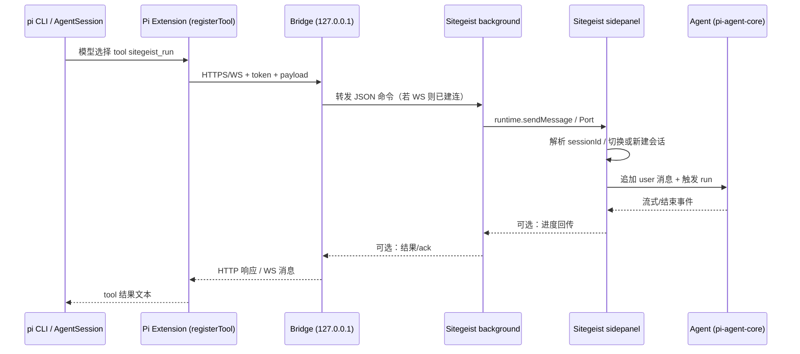
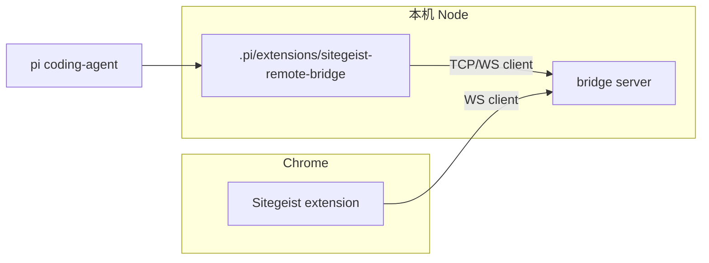

# Sitegeist Remote Bridge — 设计计划

通过 **pi-coding-agent 扩展**（本机 Node）连接 **本地桥服务** 与 **Chrome 扩展 Sitegeist**，使 CLI Agent 可向指定会话下发命令（同一会话续跑 / 多会话分流）。

---

## 1. 架构设计

### 1.1 分层与职责

| 层级 | 运行时 | 职责 |
|------|--------|------|
| **CLI Agent** | `pi` + coding-agent | 推理、拆任务；通过已注册 **Tool** 调用桥。 |
| **Pi Extension** | Node（`~/.pi/...` 或本仓库 `.pi/extensions/`） | `registerTool`：参数校验、`sessionId` / `prompt`、带 **token** 调用桥 HTTP 或 WebSocket。 |
| **Bridge** | Node（独立进程或与扩展同包 `node bridge.mjs`） | 监听 `127.0.0.1`；校验 token；维护与 Chrome 的 **单 writer** 队列；可选 request/response 关联。 |
| **Sitegeist** | MV3 background + sidepanel | 连接桥（`fetch`/WebSocket 客户端或 background 作为 **被连接方** 二选一）；解析命令；切换/创建会话；驱动现有 **Agent**（追加 user 消息并触发发送等）。 |

### 1.2 通信方向（推荐）

- **桥作为服务端**（`ws://127.0.0.1:<port>` 或 `http://127.0.0.1:<port>/command`），便于 CLI 扩展用标准 `fetch` / `WebSocket` 连接。  
- **Sitegeist 作为客户端**连桥：扩展内 `WebSocket` 长连 + 断线重连（与现有 dev live-reload 端口分离，避免冲突）。  
- **替代方案**：Sitegeist 起 `chrome.runtime` 不支持的纯 TCP server 不可行；若桥反向连扩展，需 Native Messaging 或扩展内 `offscreen` + 受限方案，**首版不推荐**。

### 1.3 安全

- 桥仅绑定 **127.0.0.1**；启动时生成或读取环境变量 `SITEGEIST_BRIDGE_TOKEN`，或本地配置文件（例如 `~/.config/sitegeist/bridge.token`，勿提交仓库）。  
- 每条消息带 `Authorization: Bearer <token>` 或等价 query；非法请求直接丢弃并打日志。  
- 不在仓库提交真实 token。

### 1.4 会话语义

- **`sessionId` 省略**：落到「当前侧栏活动会话」或协议约定默认会话（首版可强制要求显式 `sessionId` 以降低歧义）。  
- **`sessionId` 指定**：侧栏若未加载该会话 → 走与 URL/存储一致的 **加载会话** 路径，再执行命令。  
- **`newSession: true`**：创建新会话后返回新 `sessionId`，供后续工具调用复用。

---

## 2. 核心流程图

### 2.1 端到端（CLI 下发一次「在浏览器里跑」）



### 2.2 组件静态关系



---

## 3. 开发计划与文件树

### 3.1 阶段划分

| 阶段 | 目标 | 验收 |
|------|------|------|
| **P0** | 桥：本机 WS + token；Sitegeist：background 建连并校验 | **[`task_P0.md`](./task_P0.md)** |
| **P1** | 协议 v1：`{ v, cmd, sessionId?, payload }`；`ping` / `ack` | **[`task_P1.md`](./task_P1.md)** |
| **P2** | sidepanel：根据 `sessionId` 切换会话；`append_user_and_run` | **[`task_P2.md`](./task_P2.md)** |
| **P3** | Pi 扩展：`registerTool` 封装调用桥 + 错误信息 | **[`task_P3.md`](./task_P3.md)** |
| **P4** | 队列、超时、重连、文档与可选 E2E 脚本 | 日常使用稳定 |

### 3.2 目标文件树（完成后）

本仓库内（Sitegeist 侧 + 本目录扩展源码可同仓维护，便于 PR）：

```text
sitegeist/
├── .pi/
│   └── extensions/
│       └── sitegeist-remote-bridge/
│           ├── plan.md                 # 本文件
│           ├── task_P0.md              # P0 开发计划与验收标准
│           ├── task_P1.md              # P1 协议 v1 / ping / ack
│           ├── task_P2.md              # P2 append_user / 文件计划 / 验收
│           ├── task_P3.md              # Pi 扩展 registerTool / pi CLI
│           ├── CHANGELOG.md            # 本模块变更记录
│           ├── README.md               # （可选）仅文档时可为占位；实现见 badlogic 路径
│           └── …                       # 设计文档；**Pi 扩展源码** 见下方 **badlogic**
│
├── scripts/
│   ├── sitegeist-bridge.mjs            # WS server + auth + P1 v1 路由
│   ├── test-remote-bridge-p1.mjs       # P1 冒烟（需桥已运行）
│   ├── test-remote-bridge-p2.mjs       # P2 桥双角色中继冒烟
│   └── test-remote-bridge-p3.mjs       # P3：Node 模拟 Pi 工具短连接 WS
│
└── src/
    ├── background.ts                   # 入口；初始化 remote bridge 客户端
    ├── remote-bridge-protocol.ts     # P1：v1 类型与常量
    ├── remote-bridge-client.ts       # WS 客户端 + auth 后 ping（storage 开关）
    └── sidepanel.ts                    # 后续：REMOTE_* 命令、会话、Agent

badlogic/   （monorepo 根，与 sitegeist/ 并列）
├── .pi/
│   └── extensions/
│       ├── package.json                # 共享依赖：ws、typebox；pi-coding-agent（file: dev）
│       └── sitegeist-remote-bridge/
│           ├── README.md               # 安装与联调
│           ├── index.ts                # ExtensionAPI：registerTool
│           ├── bridge-client.ts        # WS 短连接（role: cli）
│           └── config.ts               # SITEGEIST_BRIDGE_* 环境变量
```

**说明**

- `pi` 默认发现路径包含 **`<cwd>/.pi/extensions/*.ts`** 与 **`<cwd>/.pi/extensions/*/index.ts`**。**本扩展实现**在 **`badlogic/.pi/extensions/sitegeist-remote-bridge/`**；请在 **`badlogic` 仓库根** 运行 `pi`，并在 **`badlogic/.pi/extensions`** 执行 **`npm install`**（安装 **`ws`**、**`typebox`** 等）。  
- **`sitegeist/.pi/extensions/sitegeist-remote-bridge/`** 目录保留 **plan / task / CHANGELOG**；与「仅在 `sitegeist` 子目录 cwd 跑 `pi`」时不会自动加载该实现（除非另行配置 `settings.json` 的 `extensions` 绝对路径）。

### 3.3 P0 任务文档

P0 的**开发计划、范围、验收清单与 DoD** 单独维护在 **[`task_P0.md`](./task_P0.md)**，本文件不再重复展开。

### 3.4 P1 任务文档

P1 的 **v1 信封、`ping`/`ack`、验收清单** 单独维护在 **[`task_P1.md`](./task_P1.md)**。

### 3.5 P2 任务文档

P2 的 **`append_user_and_run`、同 session 规则、计划新建/修改文件（仅 sitegeist + 本目录）** 见 **[`task_P2.md`](./task_P2.md)**；变更记录见 **`CHANGELOG.md`**（本目录）与 **`sitegeist/CHANGELOG.md`**。

### 3.6 P3 任务文档

P3 的 **`pi` 扩展、`registerTool`、WS 短连接、验收与风险** 见 **[`task_P3.md`](./task_P3.md)**。

### 3.7 与 coding-agent 文档的对齐

- 扩展入口：`export default function (pi: ExtensionAPI) { ... }`  
- 工具注册：`pi.registerTool({ ... })`  
- 参考：`pi-mono/packages/coding-agent/docs/extensions.md`、`examples/sdk/06-extensions.ts`

---

## 4. 协议草案（v1）

- **P1 已实现**：`ping` / `ack`、`echo`、错误信封 — 见 **[`task_P1.md`](./task_P1.md) §2**。  
- **后续（P2+）业务命令**（示意）：

```json
{
  "v": 1,
  "cmd": "append_user_and_run",
  "sessionId": "uuid 或省略",
  "payload": { "text": "string" }
}
```

响应建议：`{ "ok": true, "sessionId": "...", "message": "..." }` 或 `{ "ok": false, "error": "..." }`（落地时与 P1 信封字段对齐）。

---

## 5. 风险与依赖

- **端口**：与 `dev-server.mjs`（如 8765）错开，例如 **18766**。  
- **MV3**：background 休眠；长任务需 **keep-alive** 或 sidepanel 打开时由 sidepanel 持连。  
- **锁**：遵守现有 `acquireLock`，CLI 侧避免多进程同时写同 `sessionId`。

---

*文档版本：初稿 · 随实现迭代可更新「文件树」与协议小节。*
